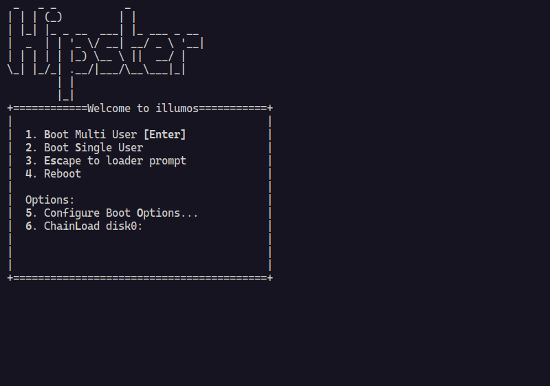

# 🌅 OpenIndiana Up

A simple, powerful CLI tool to spin up OpenIndiana virtual machines with QEMU



## ✨ Features

- 🚀 **Quick Start** - Launch OpenIndiana VMs with a single command
- 📦 **Auto-Download** - Automatically downloads ISO images from official
  sources
- 🎯 **Version Support** - Specify exact OpenIndiana versions or use the latest
  default
- 💾 **Persistent Storage** - Attach virtual disk drives for data persistence
- ⚡ **KVM Acceleration** - Native hardware acceleration for better performance
- 🌐 **SSH Ready** - Pre-configured port forwarding (host:2222 → guest:22)
- 🎛️ **Customizable** - Configure CPU, memory, cores, and disk options
- 📥 **Smart Caching** - Skips re-downloading existing ISO files
- 🎮 **VM Management** - Start, stop, list, and inspect virtual machines
- 📊 **State Persistence** - SQLite database tracks VM state and configuration
- 🏷️ **Auto-naming** - Generates unique names for VMs automatically
- 🌉 **Bridge Networking** - Support for bridge networking with custom network
  interfaces
- 🆔 **MAC Address Management** - Automatic MAC address generation for network
  devices

## 📋 Requirements

- [Deno](https://deno.land/) runtime
- QEMU with KVM support
- Linux host with KVM enabled

## 🛠️ Installation

Run the following command to install the CLI:

```bash
deno install -A -g -r -f --config deno.json ./main.ts -n openindiana-up
```

## 🚀 Quick Start

```bash
# Use default OpenIndiana version (20251026)
openindiana-up

# Specify a version
openindiana-up 20251026

# Use a local ISO file
openindiana-up /path/to/openindiana.iso

# Download from a custom URL
openindiana-up https://dlc.openindiana.org/isos/hipster/20251026/OI-hipster-text-20251026.iso
```

## 🎮 Usage

```bash
openindiana-up [path-or-url-to-iso-or-version] [options]
```

### Options

| Option                   | Description                                                  | Default      |
| ------------------------ | ------------------------------------------------------------ | ------------ |
| `-o, --output <path>`    | Output path for downloaded ISO                               | ISO filename |
| `-c, --cpu <type>`       | CPU type to emulate                                          | `host`       |
| `-C, --cpus <number>`    | Number of CPU cores                                          | `2`          |
| `-m, --memory <size>`    | RAM allocation                                               | `2G`         |
| `-d, --drive <path>`     | Path to virtual disk image                                   | None         |
| `--disk-format <format>` | Disk format (qcow2, raw, etc.)                               | `raw`        |
| `--size <size>`          | Size of the VM disk image to create if it does not exist     | `20G`        |
| `-b, --bridge <name>`    | Name of the network bridge to use for networking (e.g., br0) | None         |

### VM Management Commands

| Command                            | Description                                   |
| ---------------------------------- | --------------------------------------------- |
| `openindiana-up ps`                | List all running virtual machines             |
| `openindiana-up ps --all`          | List all virtual machines (including stopped) |
| `openindiana-up start <vm-name>`   | Start a stopped virtual machine               |
| `openindiana-up stop <vm-name>`    | Stop a running virtual machine                |
| `openindiana-up inspect <vm-name>` | Inspect virtual machine configuration         |

## 💡 Examples

### Basic VM with defaults

```bash
openindiana-up
```

### VM with custom resources

```bash
openindiana-up -C 4 -m 4G
```

### VM with persistent storage

```bash
# Create a disk image first
qemu-img create -f qcow2 openindiana-disk.qcow2 20G

# Launch with the disk attached
openindiana-up -d openindiana-disk.qcow2 --disk-format qcow2
```

### Download to specific location

```bash
openindiana-up -o ~/isos/openindiana.iso
```

### VM Management Examples

```bash
# List all running VMs
openindiana-up ps

# List all VMs (including stopped ones)
openindiana-up ps --all

# Start a specific VM
openindiana-up start my-vm-name

# Stop a running VM
openindiana-up stop my-vm-name

# Inspect VM configuration
openindiana-up inspect my-vm-name
```

### Bridge Networking

```bash
# Use bridge networking (requires bridge setup)
openindiana-up --bridge br0
```

### Automatic Disk Creation

```bash
# Automatically create a 50GB disk if it doesn't exist
openindiana-up --drive my-disk.qcow2 --disk-format qcow2 --size 50G
```

## 🖥️ Console Setup

When OpenIndiana boots, you'll see the boot menu. For the best experience with
the serial console:

1. **Select option `3. Escape to loader prompt`**
2. **Configure console output:**
   ```
   set console=ttya
   set osconsole=ttya
   set ttya-mode=115200,8,n,1,-
   boot
   ```

This enables proper console redirection to your terminal.

## ⚙️ VM Configuration

The script creates a VM with the following default specifications:

- **CPU**: Host CPU with KVM acceleration (configurable with `--cpu`)
- **Memory**: 2GB RAM (configurable with `--memory`)
- **Cores**: 2 virtual CPUs (configurable with `--cpus`)
- **Storage**: ISO-only by default; optional persistent disk (configurable with
  `--drive`)
- **Network**: User mode networking with SSH forwarding
- **Console**: Enhanced serial console via stdio with proper signal handling
- **Default Version**: OpenIndiana 20251026 (when no arguments provided)

### Available CPU Types

Common CPU types you can specify with `--cpu`:

- `host` (default) - Use host CPU features for best performance
- `qemu64` - Generic 64-bit CPU for maximum compatibility
- `Broadwell` - Intel Broadwell CPU
- `Skylake-Client` - Intel Skylake CPU
- `max` - Enable all supported CPU features

### Available Disk Formats

Common disk formats you can specify with `--disk-format`:

- `raw` (default) - Raw disk image format for maximum compatibility
- `qcow2` - QEMU Copy On Write format with compression and snapshots
- `vmdk` - VMware disk format
- `vdi` - VirtualBox disk format

## 🔌 SSH Access

The VM is configured with port forwarding for SSH access:

```bash
# After OpenIndiana is installed and SSH is configured
ssh -p 2222 user@localhost
```

## 📝 Notes

- The script uses text-based installer ISOs for better headless compatibility
- Downloaded ISOs are cached and won't be re-downloaded if they exist
- KVM acceleration requires `/dev/kvm` access on your host system
- Serial console is connected to stdio for direct interaction
- VM state is automatically persisted in a SQLite database at
  `~/.openindiana-up/state.sqlite`
- Each VM gets a unique randomly generated name using the Moniker library
- MAC addresses are automatically generated for network devices
- Bridge networking requires proper bridge configuration and may need sudo
  privileges
- VMs can be managed independently with start/stop/inspect commands

## 📜 License

See [LICENSE](LICENSE) file for details.

## 🤝 Contributing

Contributions, issues, and feature requests are welcome!

---

Made with ☀️ for OpenIndiana enthusiasts
